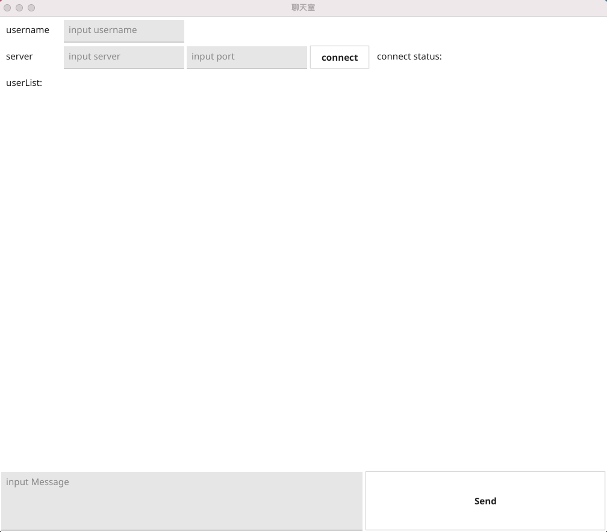
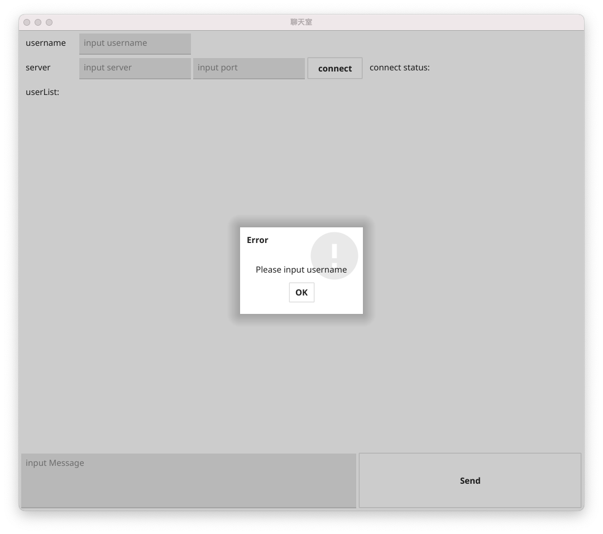
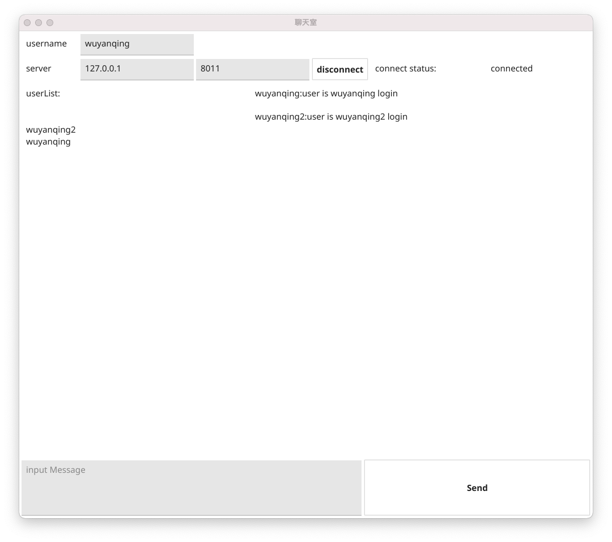
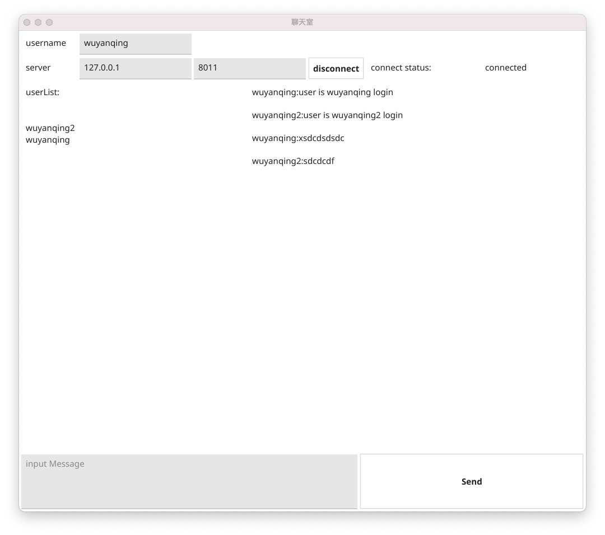
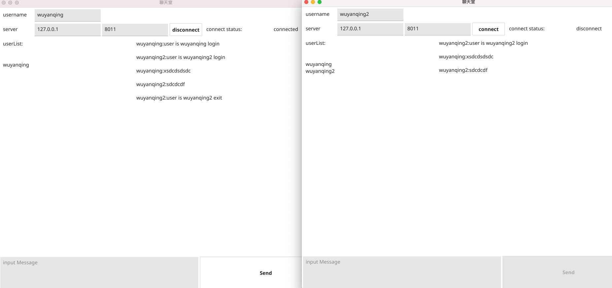
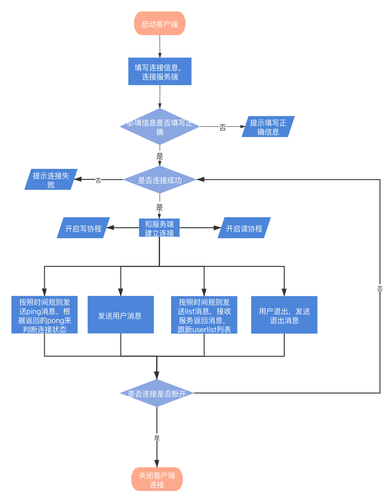

1.整体框架

使用fyne框架聊天客户端界面UI，使用gorilla框架创建websocket长链接发送和接受消息

## 2.目录结构

```
├── app
│   └── main.go
├── config
│   └── clientLog.log
├── go.mod
├── go.sum
├── internal
│   ├── handler
│   │   └── WsHandler.go
│   ├── model
│   │   ├── GeneralReward.pb.go
│   │   ├── GeneralReward.proto
│   │   └── ViewModel.go
│   ├── server
│   │   └── Client.go
│   └── utils
│       └── LogUtils.go
├── readme.md
└── view
    └── TalkView.go
```


## 3.代码逻辑分层

| 层        | 文件夹            | 主要职责               | 调用关系                 | 其他说明         |
| --------- | ----------------- | ---------------------- | ------------------------ | ---------------- |
| handler层 | /internal/handler | 处理具体业务逻辑       | 调用模型层，被控制层调用 | 不可同层相互调用 |
| server层  | /internal/server  | 通用业务逻辑           | 调用模型层               | 不可同层相互调用 |
| 模型层    | /internal/model   | 数据模型               | 被业务逻辑层调用         | 不可同层相互调用 |
| 工具层    | /internal/utils   | 工具层                 | 被各层调用               | 不可同层相互调用 |
| 配置层    | /config           | 存放配置文件和日志文件 |                          |                  |

## 4.存储设计

传输数据设计

| 内容     | 数据库 | field    | 类型   |
| -------- | ------ | -------- | ------ |
| 消息     | 无     | Msg      | string |
| 类型     | 无     | Type     | int    |
| 用户名   | 无     | Username | string |
| 扩展字段 | 无     | Ext      | string |

客户端信息设计

| 内容           | 数据库 | field    | 类型           |
| -------------- | ------ | -------- | -------------- |
| 用户名         | 无     | Username | string         |
| websocket连接  | 无     | Socket   | websocket.Conn |
| 需要发送的消息 | 无     | Send     | chan []byte    |


## 5.UI设计

界面设计：



提示信息



多用户登陆时



发消息



用户退出




## 6.第三方库

#### fyne

```
用户ui界面设计实现 代码: "fyne.io/fyne/v2"
```

#### proto

```
用于消息数据协议 代码："github.com/golang/protobuf/proto"
```

#### websocket

```
用于建立socket 长连接 代码："github.com/gorilla/websocket"
```


## 7.如何编译执行

在app文件目录下编译main.go文件后生成可执行文件main，将可执行文件文件放到根目录下进行执行。

在项目执行可执行文件的执行命令

```sh
./main
```


## 8.todo

1.后续的项目结构优化。

## 流程图


